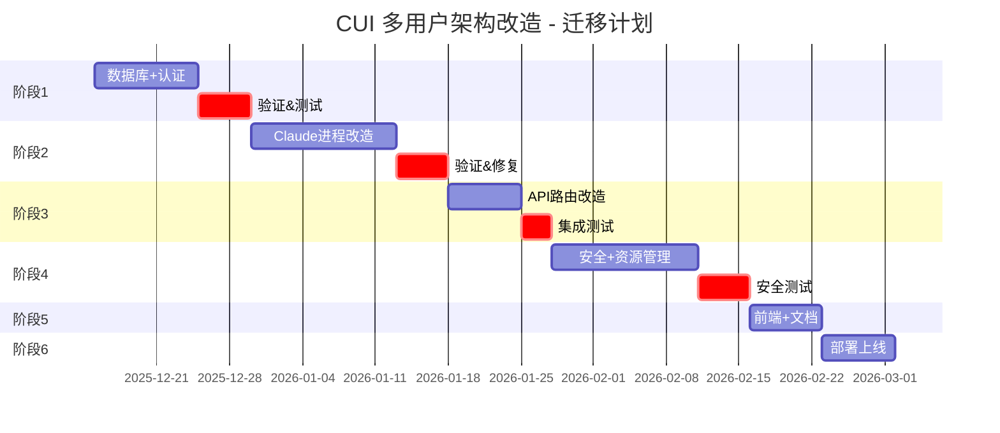
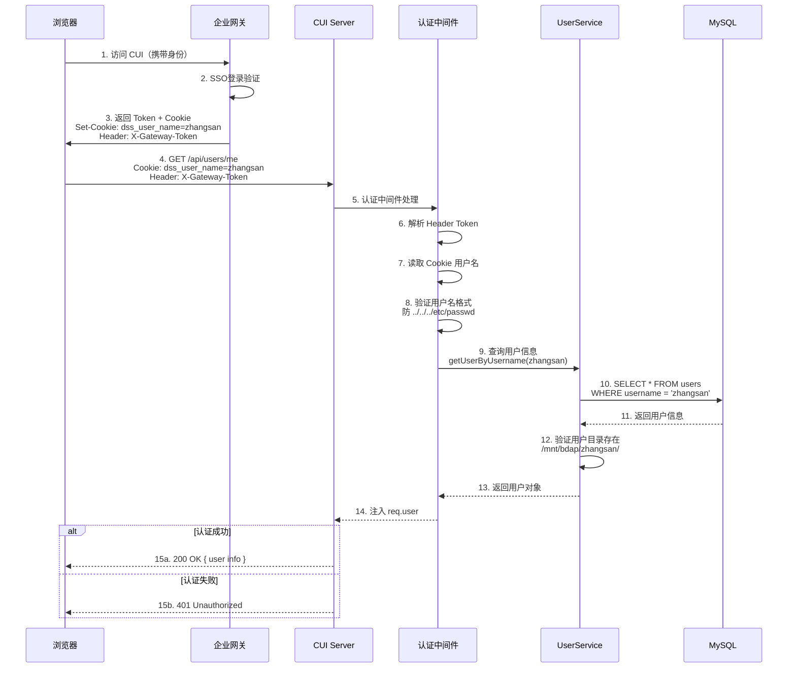
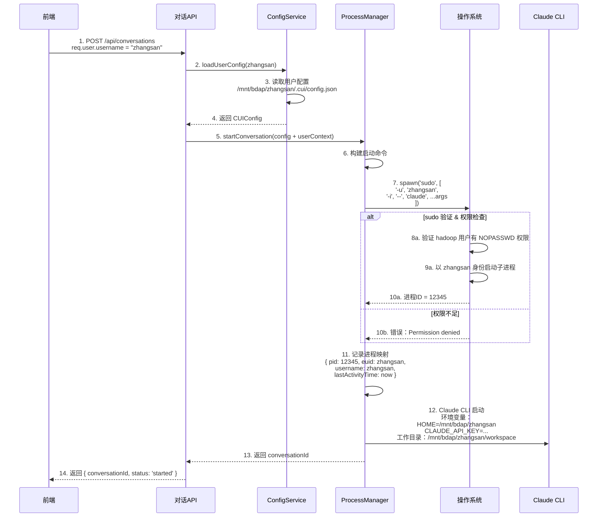
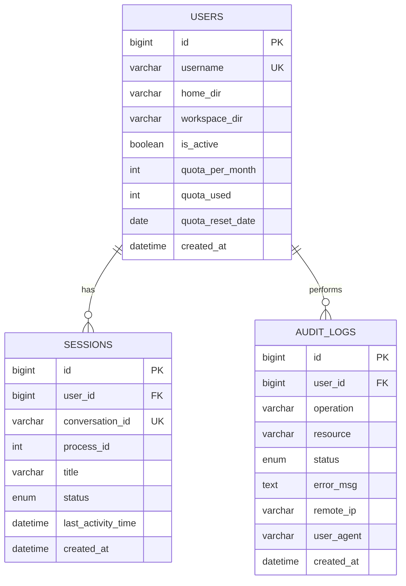

# CUI多用户架构改造 - 设计文档

## 文档信息
- **文档版本**: v1.0
- **最后更新**: 2025-12-11
- **维护人**: Claude Agent
- **文档状态**: 已批准
- **需求类型**: REFACTOR（架构重构）
- **需求文档**: [多用户架构改造_需求.md](../requirements/多用户架构改造_需求.md)

---

## 执行摘要

> 📖 **阅读指引**：本章节为1页概览（约500字），用于快速理解设计方案。详细内容请参考后续章节。

### 设计目标

| 目标 | 描述 | 优先级 |
|-----|------|-------|
| 用户隔离 | 实现每个用户的配置、会话、工作区完全隔离 | P0 |
| 进程隔离 | 使用 `sudo -u <username>` 切换用户身份运行 Claude CLI | P0 |
| 认证集成 | 通过企业网关的 Token + Cookie 实现用户身份识别 | P0 |
| 可扩展性 | 支持 2000 总用户数，200-500 并发用户 | P0 |
| 数据安全 | 实现数据库 user_id 隔离、文件系统权限隔离 | P0 |

### 核心设计决策

| 决策点 | 选择方案 | 决策理由（一句话） | 替代方案 |
|-------|---------|------------------|---------|
| 重构策略 | 渐进式开发（6个阶段） | 风险可控，每个阶段独立验证 | 大爆炸开发（风险高） |
| 数据库 | MySQL 8.0 | 支持多用户并发写入，企业级部署 | PostgreSQL（功能强，学习成本稍高） |
| 认证方案 | 网关统一认证（Token+Cookie） | 集成简单，复用企业网关投资 | 自研JWT/LDAP（复杂度高） |
| 进程隔离 | sudo -u <username> 切换用户 | 利用 Linux 权限模型，隔离彻底 | Docker 容器（开销大） |
| 文件存储 | 用户目录映射到 `/mnt/bdap/<username>/` | 符合企业运维规范，支持权限管理 | 虚拟路径映射（管理复杂） |
| 部署策略 | 新环境全新部署 | 独立环境，无历史包袱，风险低 | 原地升级（风险高，需迁移） |

### 架构概览图

```
┌──────────────────────────────────────────────────────────────┐
│                      前端应用（React）                        │
│                   + 网关认证（SSO）                            │
└────────────────────┬─────────────────────────────────────────┘
                     │ Token + Cookie (user context)
        ┌────────────▼──────────────┐
        │   CUI Server (Node.js)    │
        │                          │
        │ ┌──────────────────────┐ │
        │ │ 认证中间件           │ │  验证Token & Cookie
        │ │ gatewayAuthMiddleware│ │  注入 req.user 上下文
        │ └────────┬─────────────┘ │
        │          │               │
        │ ┌────────▼────────────┐  │
        │ │ API 路由（按用户）  │  │  /api/conversations
        │ │ 用户隔离处理        │  │  /api/users/me
        │ └────────┬────────────┘  │
        │          │               │
        │ ┌────────▼───────────────────────┐
        │ │ ProcessManager (sudo -u user)  │  ← 核心：进程隔离
        │ │ ConfigService (user config)    │  ← 用户级配置
        │ │ SessionInfoService (user_id)   │  ← 会话隔离
        │ └────────┬───────────────────────┘
        │          │
        │ ┌────────▼─────────────┐
        │ │ Claude CLI (Linux)   │  以真实用户身份运行
        │ │ euid = 真实用户ID    │  访问用户目录
        │ └──────────────────────┘
        └────────────┬──────────────┘
                     │
        ┌────────────┼──────────────────────┐
        │            │                      │
┌───────▼────┐ ┌────▼─────────┐ ┌─────────▼──────┐
│  MySQL DB  │ │ User Dirs    │ │ Audit Logs     │
│ user_id    │ │ /mnt/bdap/   │ │ .cui/logs/     │
│ isolation  │ │ <username>/  │ │ <username>/    │
└────────────┘ └──────────────┘ └────────────────┘
```

### 关键风险与缓解

| 风险 | 等级 | 缓解措施 |
|-----|------|---------|
| Sudo 权限配置错误 | 高 | 自动化验证脚本 + 充分测试 + 降级方案 |
| 网关集成问题 | 高 | 与网关团队提前对接 + 模拟测试 + 本地认证降级 |
| 进程泄露资源耗尽 | 中 | 进程生命周期管理 + 监控告警 + ulimit 限制 |
| 团队不熟悉新架构 | 中 | 技术分享 + 详细文档 + 代码示例注释 |

### 核心指标

| 指标 | 目标值 | 说明 |
|-----|-------|------|
| 并发用户数 | 200-500 | 压测验证 |
| 总用户数 | 2000 | 数据库容量验证 |
| 用户隔离程度 | 100% | 完全隔离，无交叉污染 |
| 进程隔离程度 | 100% | euid 为真实用户 |
| 回收不误收 | 99.9% | 心跳机制防误回收 |

### 章节导航

| 关注点 | 推荐章节 |
|-------|---------|
| 想了解整体架构 | [1.1 系统架构设计](#11-系统架构设计) |
| 想了解开发阶段 | [1.2 渐进式开发计划](#12-渐进式开发计划) |
| 想了解核心流程 | [1.3 核心流程设计](#13-核心流程设计) |
| 想了解进程隔离 | [1.4 进程隔离实现](#14-进程隔离实现) |
| 想了解数据模型 | [2.1 数据模型设计](#21-数据模型设计) |
| 想了解API规范 | [2.2 API规范设计](#22-api规范设计) |
| 想了解测试方案 | [2.4 测试策略](#24-测试策略) |
| 想查看完整代码 | [3.2 完整代码示例](#32-完整代码示例) |

---

# Part 1: 核心设计

> 🎯 **本层目标**：阐述架构决策、核心流程、关键接口，完整详细展开。
>
> **预计阅读时间**：10-15分钟

## 1.1 系统架构设计

### 1.1.1 目标架构概述

**从单用户到多用户的核心变更**：

```
当前架构（单用户）              目标架构（多用户）
────────────────────            ────────────────────

ConfigService (全局)    →        ConfigService (用户级)
  读取：~/.cui/*                  读取：/mnt/bdap/<user>/.cui/*

ClaudeProcessManager    →        ClaudeProcessManager (隔离)
  启动进程：hadoop身份              启动进程：sudo -u <user>

SessionInfoService      →        SessionInfoService (隔离)
  全局存储                        按user_id查询过滤

无认证                  →        gatewayAuthMiddleware
                                 Token + Cookie 认证

SQLite (单机)           →        MySQL (多用户并发)
  无user_id隔离                   user_id 隔离，索引优化

无权限控制              →        Linux权限 + 应用级隔离
                                 700权限 + 路径验证
```

### 1.1.2 模块划分

| 模块 | 职责 | 对外接口 | 依赖 |
|-----|------|---------|------|
| **gatewayAuthMiddleware** | Token & Cookie验证，注入req.user | req.user={username, homeDir, ...} | 无 |
| **UserMappingService** | 读取系统用户，验证用户目录存在 | getUserMapping(username) | Linux getent |
| **ConfigService(增强)** | 加载用户级配置，缓存管理 | loadUserConfig(username) | UserMappingService |
| **ClaudeProcessManager(增强)** | 以sudo-u切换用户启动进程 | startConversation(config+userContext) | ConfigService, UserMappingService |
| **SessionInfoService(增强)** | 会话存储，按user_id隔离 | getSessionsByUser(userId) | MySQL |
| **ProcessLifecycleManager(新增)** | 空闲回收、LRU淘汰、心跳管理 | terminateIdleProcess() | ClaudeProcessManager |
| **AuditLogger(新增)** | 记录用户操作，满足合规 | logOperation(user, action) | MySQL |
| **RateLimitMiddleware(新增)** | 单用户API请求限流 | checkRateLimit(userId) | Redis (可选) |

### 1.1.3 技术选型与对比

| 维度 | 选型 | 版本 | 理由 |
|-----|------|------|------|
| 数据库 | MySQL | 8.0+ | 成熟、企业标准、支持多用户并发写入 |
| 认证 | 网关Token+Cookie | N/A | 集成简单、复用企业投资、无需自研 |
| 进程隔离 | sudo -u <user> | Linux native | 利用Linux权限模型、隔离彻底、可靠 |
| 配置管理 | 用户目录映射 | 企业规范 | 符合运维规范、支持权限管理 |

---

## 1.2 渐进式开发计划

**总体时间线**：1.5-2.5个月（7-11周）



**关键路径**：阶段1 → 阶段2 → 阶段3 → 阶段6（串行）
**并行任务**：阶段4-5 可与阶段3 部分并行

### 阶段1：基础架构改造（1-2周）【P0】

**目标**：建立多用户基础框架，验证网关认证

**核心改造**：

1. **数据库设计与实现**（MySQL）
   - 创建 `users`、`sessions`、`audit_logs` 表
   - 设计 `user_id` 字段和表关系
   - 创建索引以支持多用户查询

2. **认证中间件**（`gatewayAuthMiddleware`）
   - 验证 Header: `X-Gateway-Token`
   - 读取 Cookie: `dss_user_name`
   - 验证用户名格式，防路径注入
   - 验证用户目录存在（`/mnt/bdap/<username>/`）
   - 注入 `req.user` 上下文

3. **用户映射服务**（`UserMappingService`）
   - 读取系统用户信息（`getent passwd`）
   - 验证用户目录映射
   - 返回 HOME、workspace、.claude、.cui 等路径

4. **用户数据库服务**（`UserService`）
   - 查询用户信息
   - 更新用户偏好
   - 配额查询与限制

**验收标准**：
- MySQL 表创建成功，可执行多用户查询
- 网关认证中间件通过单元测试
- 用户上下文正确注入到 `req.user`
- 用户目录验证无假阳性

**风险等级**：低

---

### 阶段2：Claude CLI 多用户改造（2-3周）【P0】

**目标**：实现 Claude CLI 进程和配置的用户隔离

**核心改造**：

1. **ConfigService 多用户化**
   ```typescript
   // 扩展 ConversationConfig 类型
   interface MultiUserConversationConfig extends ConversationConfig {
     userContext: {
       username: string;           // zhangsan, lisi
       homeDir: string;            // /mnt/bdap/zhangsan
       workspaceDir: string;       // /mnt/bdap/zhangsan/workspace
       claudeDir: string;          // /mnt/bdap/zhangsan/.claude
       cuiDir: string;             // /mnt/bdap/zhangsan/.cui
     };
   }
   ```
   - 新增 `loadUserConfig(username, userCuiDir)` 方法
   - 配置读取路径：`/mnt/bdap/<username>/.cui/config.json`
   - 维护 `Map<username, CUIConfig>` 用户配置缓存

2. **ClaudeProcessManager 进程隔离**（⭐ 核心）
   ```typescript
   // 关键改造：使用 sudo -u <username> 切换用户
   const proc = spawn('sudo', [
     '-u', username,
     '-i',                          // 加载用户环境变量
     '--',
     'claude',
     ...args
   ], {
     cwd: userContext.workspaceDir,
     // 关键：进程的有效用户（euid）= 真实用户
     // 进程只能访问用户自己的文件（Linux权限控制）
   });
   ```
   - 权限隔离机制：
     - CUI Server 以 `hadoop` 用户运行（超级管理员）
     - 启动 Claude CLI 时切换到真实用户
     - 进程 euid = 真实用户（非 hadoop）
   - 支持多并发用户，每个用户独立进程

3. **ClaudeHistoryReader 历史隔离**
   - 修改历史读取路径：`/mnt/bdap/<username>/.claude/projects/`
   - 按用户隔离会话历史文件

4. **SessionInfoService 会话隔离**
   - 会话查询添加 `WHERE user_id = ?` 过滤
   - 会话创建时记录 `user_id`

**验收标准**：
- 不同用户的 Claude CLI 使用各自的 HOME 目录
- 进程 euid 是真实用户，验证 `ps -eo pid,euid,cmd`
- 用户 A 无法访问用户 B 的文件（权限拒绝）
- 会话历史按用户隔离，无交叉污染
- 配置加载路径正确

**风险等级**：中（进程隔离关键，需要充分测试）

---

### 阶段3：路由和 API 改造（1周）【P0】

**目标**：所有 API 支持网关认证和用户上下文

**核心改造**：

1. **认证中间件应用**
   - 所有 `/api/*` 路由应用 `gatewayAuthMiddleware`
   - `/health`、`/metrics` 等公开接口豁免

2. **用户路由新增**
   ```
   GET    /api/users/me              获取当前用户信息
   PATCH  /api/users/me/preferences  更新用户偏好
   GET    /api/users/me/quota        查询配额使用
   ```

3. **现有路由改造**
   - 对话路由：传递 `req.user.username` 到 ProcessManager
   - 文件系统路由：限制访问范围到 `userContext.workspaceDir`
   - 流式路由：SSE 连接验证 Token + Cookie

4. **SSE 认证处理**
   - 浏览器 EventSource 自动携带 Cookie
   - 企业网关自动注入 Header
   - 后端 `gatewayAuthMiddleware` 验证

**验收标准**：
- 所有 API 需要认证才能访问
- 未认证请求返回 401
- 用户只能访问自己的资源
- SSE 连接正确认证

**风险等级**：低

---

### 阶段4：安全加固与资源管理（2-3周）【P1】

**目标**：提升系统安全性与稳定性

**核心改造**：

1. **进程生命周期管理**（新增 `ProcessLifecycleManager`）
   - **空闲超时回收**（Idle GC）：
     - 维护每个会话的 `lastActivityTime`
     - 定时扫描（每分钟），超过 10 分钟无交互 → kill 进程
   - **连接断开联动**：
     - 监听 SSE 连接 `close` 事件
     - 启动倒计时（10分钟），未重连则回收
   - **LRU 进程淘汰**：
     - 设置最大并发数（如 100 个）
     - 达到上限时，强制回收"最久未活动"的进程
   - **前端心跳机制**：
     - 前端每分钟发送 `POST /api/heartbeat`
     - 防止正在使用的进程被误回收

2. **用户级日志分流**
   - Claude CLI 的 stdout/stderr 重定向到用户目录
   - 路径：`/mnt/bdap/<username>/.cui/logs/claude-cli-<date>.log`

3. **审计日志**（新增 `AuditLogger`）
   - 记录：启动对话、执行Bash、文件操作
   - 存储到 `audit_logs` 表
   - 包含：用户、操作、资源、时间、IP、结果

4. **速率限制**（新增中间件）
   - 限制单用户 API 请求频率（如 100 req/min）
   - 基于 userId 限流，防止恶意攻击

5. **文件系统权限验证**
   - 用户目录权限：`700 (drwx------)`
   - 目录所有者：真实用户
   - 配置文件权限：`600 (-rw-------)`
   - 编写验证脚本：`scripts/verify-permissions.sh`

**验收标准**：
- 空闲进程在 10 分钟后自动回收
- 达到最大并发数时，旧进程被正确淘汰
- 连接断开后，资源及时释放
- 每个用户日志写入各自目录
- 关键操作有审计记录
- API 有速率限制
- 文件权限检验通过

**风险等级**：中

---

### 阶段5：前端改造和测试（1-2周）【P1】

**目标**：前端适配多用户体验，完善测试

**核心改造**：

1. **前端适配**（简化，无需登录页面）
   - 用户信息展示（当前用户名、配额）
   - 配额使用提示（接近上限时警告）
   - 会话列表隔离提示

2. **测试**
   - **单元测试**：
     - `gatewayAuthMiddleware` Token/Cookie 验证
     - `UserMappingService` 用户目录读取
     - `ConfigService` 多用户配置加载
   - **集成测试**：
     - 用户隔离验证（用户A无法访问用户B资源）
     - 进程隔离验证（进程euid为真实用户）
     - 会话隔离验证（会话按user_id过滤）
   - **压力测试**：
     - 200 并发用户登录
     - 500 并发对话
   - **安全测试**：
     - 路径注入攻击（`../../../etc/passwd`）
     - 权限越权（跨用户访问）

3. **文档**
   - 用户手册：如何通过网关访问
   - 管理员手册：网关配置、用户目录初始化、监控指南
   - API文档：认证方式说明
   - 故障排查指南

**验收标准**：
- 用户通过网关访问系统
- 测试覆盖率 > 80%
- 文档完善
- 所有安全测试通过

**风险等级**：低

---

### 阶段6：部署和上线（1周）【P0】

**目标**：生产环境部署并验证

**核心任务**：
1. 服务器配置（16-32核、128GB RAM、500GB SSD）
2. MySQL 数据库部署与初始化
3. 环境变量配置（`GATEWAY_TOKEN`、数据库连接）
4. Systemd 服务配置（以 `hadoop` 用户运行）
5. Nginx 反向代理（HTTPS、SSE支持）
6. 监控告警配置
7. 性能基准测试

**验收标准**：
- 系统在生产环境稳定运行
- 监控和告警正常
- 性能满足要求（200-500并发）

**风险等级**：中

---

## 1.3 核心流程设计

### 1.3.1 用户登录与请求处理流程



#### 关键节点说明

| 节点 | 处理逻辑 | 输入/输出 | 异常处理 |
|-----|---------|----------|---------|
| 4. 请求 | 浏览器携带 Token 和 Cookie 发送请求 | **输入**: Header、Cookie<br>**输出**: HTTP请求 | 无Token/Cookie返回401 |
| 6-8. 认证验证 | 解析和验证 Token、Cookie、用户名格式 | **输入**: Token、Cookie<br>**输出**: 合法用户名或错误 | 格式错误返回400 |
| 9-13. 查询用户 | 查询数据库获取用户信息，验证目录存在 | **输入**: 用户名<br>**输出**: 用户对象或null | 用户不存在返回401 |
| 14. 注入上下文 | 将用户信息注入到 req.user，后续路由可用 | **输入**: 用户对象<br>**输出**: req.user | 注入失败返回500 |

#### 技术难点与解决方案

| 难点 | 问题描述 | 解决方案 | 决策理由 |
|-----|---------|---------|---------|
| Token验证可靠性 | 网关Token格式未明确，可能变更 | 与网关团队确认Token格式和验证方式，编写单元测试覆盖 | 早期对接减少集成风险 |
| 路径注入防护 | 用户名来自Cookie，可能被篡改为 `../` 等 | 白名单验证：用户名仅允许字母数字下划线，长度1-32 | 防止目录遍历攻击 |
| 目录存在验证 | 需要高效验证大量用户目录存在 | 缓存已验证用户，定期刷新；使用 stat 而非 ls | 避免频繁文件系统调用 |
| 并发认证 | 高并发请求可能导致认证瓶颈 | 使用 Redis 缓存用户信息，减少数据库查询；设置缓存TTL 5分钟 | 权衡一致性和性能 |

#### 边界与约束说明

- **前置条件**：网关已完成SSO登录，浏览器有有效Token + Cookie
- **后置保证**：认证通过后，req.user 注入用户完整信息，后续路由可信任
- **并发约束**：支持并发，无状态设计，每个请求独立验证
- **性能约束**：认证 P99 < 50ms（含数据库查询）
- **幂等性**：认证流程幂等，重复请求返回相同结果

---

### 1.3.2 用户启动对话流程



#### 关键节点说明

| 节点 | 处理逻辑 | 输入/输出 | 异常处理 |
|-----|---------|----------|---------|
| 2-4. 配置加载 | 从用户目录读取配置文件，缓存 | **输入**: username<br>**输出**: CUIConfig 对象 | 文件不存在→使用默认配置 |
| 6-10. 进程启动 | 使用 sudo -u 切换用户，启动Claude CLI | **输入**: 用户名、启动参数<br>**输出**: 进程ID (PID) | sudo失败→返回错误提示 |
| 11. 进程追踪 | 维护进程映射表，记录 euid、活动时间 | **输入**: PID、用户名<br>**输出**: 内存映射表更新 | 映射重复→覆盖旧记录 |
| 12-14. 返回结果 | 返回对话ID供前端 SSE 连接 | **输入**: 无<br>**输出**: conversationId | 无异常情况 |

#### 技术难点与解决方案

| 难点 | 问题描述 | 解决方案 | 决策理由 |
|-----|---------|---------|---------|
| Sudo权限配置 | sudo 需要 NOPASSWD 权限，否则需要密码输入 | 编写部署脚本配置 sudoers 文件；自动化验证脚本 | 减少运维错误 |
| 环境变量继承 | Claude CLI 需要继承用户的环境变量 | 使用 `sudo -i` 加载用户完整登录环境 | 确保HOME、PATH等正确 |
| 进程僵尸问题 | 子进程退出后可能变成僵尸进程 | 父进程监听 SIGCHLD，及时 waitpid() | 防止进程表污染 |
| 大量并发启动 | 短时间内启动大量进程可能超过系统限制 | 设置 ulimit、使用进程池管理 | 保证系统稳定性 |

#### 边界与约束说明

- **前置条件**：用户已认证，用户目录存在且权限正确 (700)，sudo 配置完成
- **后置保证**：Claude CLI 进程以真实用户身份运行，euid = 真实用户ID
- **并发约束**：支持高并发启动，每个用户最多100个并发进程（LRU淘汰）
- **性能约束**：启动延迟 P99 < 2s（含文件系统操作）
- **幂等性**：非幂等，重复请求产生新进程

---

## 1.4 进程隔离实现

### 权限隔离模型

```
CUI Server (hadoop:hadoop)
  └─ euid=0 (root equivalent)
      │
      └── Clone (sudo verification)
           │
           └─ Setuid to zhangsan (真实用户)
                │
                └─ Claude CLI 进程
                     euid = 1001 (zhangsan)
                     uid = 1001 (zhangsan)
                     gid = 1001 (zhangsan)

                     可访问的资源：
                     - /mnt/bdap/zhangsan/         (700)
                     - /home/zhangsan/             (700)
                     - /var/tmp/                   (RWX)

                     无法访问：
                     - /mnt/bdap/lisi/             (700, 另一用户)
                     - /root/                      (700)
                     - /etc/shadow                 (仅root可读)
```

### 验证进程隔离

```bash
# 方案1：ps 检查 euid
$ ps -eo pid,euid,cmd | grep claude

# 输出示例：
#  1234  1001 claude code ...  （zhangsan启动）
#  1235  1002 claude code ...  （lisi启动）
#  1236     0 /bin/bash        （hadoop启动的管理进程）

# 方案2：ls 检查文件权限
$ ls -ld /mnt/bdap/zhangsan /mnt/bdap/lisi
drwx------ 5 zhangsan zhangsan   /mnt/bdap/zhangsan
drwx------ 5 lisi     lisi       /mnt/bdap/lisi

# 方案3：尝试跨用户访问（应该失败）
$ sudo -u zhangsan cat /mnt/bdap/lisi/.cui/config.json
# 输出：cat: /mnt/bdap/lisi/.cui/config.json: Permission denied ✅
```

---

## 1.5 关键接口定义

### 1.5.1 认证中间件接口

```typescript
/**
 * 网关认证中间件
 *
 * 核心职责：
 * 1. 验证 X-Gateway-Token Header
 * 2. 读取 dss_user_name Cookie
 * 3. 验证用户名格式和目录存在
 * 4. 注入 req.user 上下文
 */
interface GatewayAuthMiddleware {
  /**
   * 中间件处理函数
   *
   * 核心逻辑：
   * 1. 解析 request 中的 Token 和 Cookie
   * 2. 调用 UserMappingService 验证用户信息
   * 3. 注入 req.user = { username, homeDir, ... }
   * 4. 调用 next() 继续处理
   *
   * @param req Express Request
   * @param res Express Response
   * @param next 下一个中间件
   * @throws 无认证信息 → 返回 401
   * @throws 用户不存在 → 返回 401
   * @throws 格式非法 → 返回 400
   */
  (req: Request, res: Response, next: NextFunction): void;
}

interface UserContext {
  username: string;        // 用户名：zhangsan
  homeDir: string;         // /mnt/bdap/zhangsan
  workspaceDir: string;    // /mnt/bdap/zhangsan/workspace
  claudeDir: string;       // /mnt/bdap/zhangsan/.claude
  cuiDir: string;          // /mnt/bdap/zhangsan/.cui
}
```

### 1.5.2 ConfigService 接口

```typescript
/**
 * 多用户配置服务
 *
 * 核心职责：
 * 1. 按用户加载 .cui/config.json
 * 2. 缓存用户配置，避免频繁文件IO
 * 3. 支持配置热更新
 */
interface ConfigService {
  /**
   * 加载用户配置
   *
   * @param username 用户名
   * @param userCuiDir 用户 .cui 目录路径
   * @return 用户配置对象，若不存在则返回默认配置
   */
  loadUserConfig(username: string, userCuiDir: string): Promise<CUIConfig>;

  /**
   * 获取缓存的配置（快速路径）
   */
  getCachedConfig(username: string): CUIConfig | null;

  /**
   * 清除用户配置缓存
   */
  clearUserCache(username: string): void;
}
```

### 1.5.3 ClaudeProcessManager 接口

```typescript
/**
 * 多用户进程管理器
 *
 * 核心职责：
 * 1. 以 sudo -u <user> 启动 Claude CLI 进程
 * 2. 维护进程与用户的映射关系
 * 3. 支持进程生命周期管理（创建、终止、回收）
 */
interface ClaudeProcessManager {
  /**
   * 启动用户对话
   *
   * @param config 对话配置
   * @param userContext 用户上下文（必须包含 username）
   * @return conversationId 和进程信息
   *
   * 核心逻辑：
   * 1. 使用 ConfigService 加载用户配置
   * 2. 构建 spawn 命令：sudo -u <username> -i -- claude ...
   * 3. 执行进程，获取 PID
   * 4. 记录进程映射：{ pid, euid, username, lastActivityTime }
   * 5. 返回 conversationId
   */
  startConversation(
    config: MultiUserConversationConfig,
    userContext: UserContext
  ): Promise<{ conversationId: string; processInfo: ProcessInfo }>;

  /**
   * 获取用户的所有进程
   *
   * @param username 用户名
   * @return 该用户启动的所有进程列表
   */
  getProcessesByUser(username: string): ProcessInfo[];

  /**
   * 更新进程活动时间（心跳）
   */
  updateProcessActivity(pid: number): void;

  /**
   * 终止进程
   */
  terminateProcess(pid: number): Promise<void>;
}
```

---

## 1.6 设计决策记录 (ADR)

### ADR-001: 使用 sudo -u 切换用户隔离进程

**状态**：已采纳

**背景**：需要在 Linux 系统上实现进程级别的用户隔离，确保一个用户的进程无法访问其他用户的文件。

**决策**：采用 `sudo -u <username> -i -- claude ...` 切换到真实用户身份启动 Claude CLI 进程。

**选项对比**：

| 选项 | 优点 | 缺点 | 适用场景 |
|-----|------|------|---------|
| **sudo -u 切换用户**（采纳） | 利用成熟的Linux权限模型，隔离彻底可靠，运维标准做法 | 需要 NOPASSWD sudo 配置 | 企业Linux环境 |
| Docker 容器隔离 | 隔离更彻底，包括网络命名空间 | 开销大，性能损耗，需要容器编排 | 微服务架构 |
| chroot/chown 修改所有权 | 避免 sudo，简化权限配置 | 文件所有权不符合运维规范，难以管理 | 无 |

**结论**：
Linux 权限模型经过数十年验证，`sudo` 是标准方案。与其他复杂方案相比，`sudo -u` 足够可靠且易于运维。

**影响**：
- 部署时需要配置 sudoers：`hadoop ALL=(ALL) NOPASSWD: /usr/bin/claude`
- 需要编写验证脚本确保配置正确
- 进程隔离由Linux内核保证，安全可靠

---

### ADR-002: MySQL 替代 SQLite

**状态**：已采纳

**背景**：单用户架构下 SQLite 足够，但多用户并发写入会导致数据库锁竞争。

**决策**：迁移到 MySQL 8.0+，使用 `user_id` 隔离数据。

**选项对比**：

| 选项 | 优点 | 缺点 | 适用场景 |
|-----|------|------|---------|
| **MySQL 8.0**（采纳） | 成熟、企业标准、并发性能好、生态完善 | 需要独立部署、维护成本稍高 | 企业级应用 |
| PostgreSQL 15 | 功能强大、JSON支持、JSONB性能优秀 | 学习成本、社区相对小 | 数据分析场景 |
| SQLite WAL模式 | 无需迁移，简单快速 | 单机瓶颈明显，远不如MySQL | 单机小规模场景 |

**结论**：
MySQL 是企业标准选择，团队通常有 MySQL 部署运维经验，降低学习成本。

**影响**：
- 所有查询必须添加 `WHERE user_id = ?` 过滤
- 需要 `user_id` 索引优化
- 数据库连接池配置调优

---

### ADR-003: 网关统一认证而非自研 JWT

**状态**：已采纳

**背景**：需要识别用户身份，可以自研 JWT 认证或接入企业网关。

**决策**：接入企业网关的 Token + Cookie 认证。

**选项对比**：

| 选项 | 优点 | 缺点 | 适用场景 |
|-----|------|------|---------|
| **网关认证**（采纳） | 集成简单、复用企业投资、已有SSO | 依赖网关稳定性、规范可能变更 | 企业内部系统 |
| 自研 JWT | 独立自主、定制化 | 工作量大、需要Token刷新、加密复杂 | 独立产品 |
| LDAP 直连 | 与企业AD集成深 | 集成复杂、性能风险 | 企业内网环境 |

**结论**：
企业已有网关投资和成熟的SSO，应该复用而非重复建设。

**影响**：
- 需要与网关团队协商 Token 格式和传递方式
- Cookie 名称可能与网关协议变更
- 本地认证作为降级方案

---

## 1.7 关键技术难点汇总

| 难点 | 风险 | 缓解措施 | 优先级 |
|-----|------|---------|-------|
| **Sudo 权限配置** | 高 | 自动化验证脚本 + 降级方案 | P0 |
| **网关集成时序** | 高 | 提前协商 + 模拟网关环境 + 本地降级 | P0 |
| **用户目录权限** | 高 | 权限验证脚本 + 运维培训 | P0 |
| **进程泄露导致资源耗尽** | 中 | 进程生命周期管理 + 监控告警 | P1 |
| **数据库迁移失败** | 中 | 迁移脚本测试 + 回滚方案 | P1 |
| **心跳机制误判** | 中 | 心跳间隔调优 + 宽松的回收阈值 | P1 |
| **团队架构不熟悉** | 中 | 技术分享 + 文档注释 + 代码示例 | P2 |

---

# Part 2: 支撑设计

> 📐 **本层目标**：数据模型、API规范、配置策略的结构化摘要。
>
> **预计阅读时间**：5-10分钟

## 2.1 数据模型设计

### 2.1.1 用户表 (users)

**表说明**：存储系统用户基本信息

| 字段名 | 类型 | 说明 | 约束 | 索引 |
|-------|------|------|------|------|
| id | BIGINT | 用户ID | PK, AUTO_INCREMENT | PK |
| username | VARCHAR(32) | 用户名 | NOT NULL, UNIQUE | UNIQUE |
| home_dir | VARCHAR(256) | 用户主目录 | NOT NULL | - |
| workspace_dir | VARCHAR(256) | 工作目录 | NOT NULL | - |
| is_active | BOOLEAN | 是否活跃 | NOT NULL, DEFAULT 1 | - |
| quota_per_month | INT | 月度配额（对话次数） | NOT NULL, DEFAULT 100 | - |
| quota_used | INT | 本月已使用 | NOT NULL, DEFAULT 0 | - |
| quota_reset_date | DATE | 配额重置日期 | NOT NULL | - |
| created_at | DATETIME | 创建时间 | NOT NULL, DEFAULT NOW() | IDX |
| updated_at | DATETIME | 更新时间 | NOT NULL, DEFAULT NOW() | - |

**索引设计**：

| 索引名 | 类型 | 字段 | 用途 |
|-------|------|------|------|
| PRIMARY | 主键 | id | 主键查询 |
| UNIQUE idx_username | 唯一索引 | username | 用户名查询、防重复 |
| idx_created_at | 普通索引 | created_at | 时间范围查询 |

---

### 2.1.2 会话表 (sessions)

**表说明**：存储用户对话会话信息

| 字段名 | 类型 | 说明 | 约束 | 索引 |
|-------|------|------|------|------|
| id | BIGINT | 会话ID | PK, AUTO_INCREMENT | PK |
| user_id | BIGINT | 用户ID | NOT NULL, FK | FK, IDX |
| conversation_id | VARCHAR(64) | 对话ID | NOT NULL, UNIQUE | UNIQUE |
| process_id | INT | 进程ID | NOT NULL | IDX |
| title | VARCHAR(256) | 会话标题 | DEFAULT '' | - |
| status | ENUM('running', 'completed', 'error') | 会话状态 | NOT NULL | IDX |
| last_activity_time | DATETIME | 最后活动时间 | NOT NULL | IDX |
| created_at | DATETIME | 创建时间 | NOT NULL, DEFAULT NOW() | - |
| updated_at | DATETIME | 更新时间 | NOT NULL, DEFAULT NOW() | - |

**索引设计**：

| 索引名 | 类型 | 字段 | 用途 |
|-------|------|------|------|
| FK idx_user_id | 外键索引 | user_id | 按用户查询会话 |
| UNIQUE idx_conversation_id | 唯一索引 | conversation_id | 会话去重 |
| idx_status_user | 复合索引 | status, user_id | 按用户和状态查询 |
| idx_last_activity | 普通索引 | last_activity_time | 进程回收扫描 |

---

### 2.1.3 审计日志表 (audit_logs)

**表说明**：记录用户操作，满足企业合规要求

| 字段名 | 类型 | 说明 | 约束 | 索引 |
|-------|------|------|------|------|
| id | BIGINT | 日志ID | PK, AUTO_INCREMENT | PK |
| user_id | BIGINT | 用户ID | NOT NULL, FK | FK, IDX |
| operation | VARCHAR(64) | 操作类型 | NOT NULL | IDX |
| resource | VARCHAR(256) | 资源描述 | NOT NULL | - |
| status | ENUM('success', 'failure') | 操作结果 | NOT NULL | - |
| error_msg | TEXT | 错误信息 | DEFAULT NULL | - |
| remote_ip | VARCHAR(45) | 客户端IP | NOT NULL | IDX |
| user_agent | VARCHAR(256) | 用户代理 | DEFAULT NULL | - |
| created_at | DATETIME | 操作时间 | NOT NULL, DEFAULT NOW() | IDX |

**索引设计**：

| 索引名 | 类型 | 字段 | 用途 |
|-------|------|------|------|
| FK idx_user_id | 外键索引 | user_id | 按用户查询操作日志 |
| idx_operation | 普通索引 | operation | 按操作类型查询 |
| idx_created_at | 普通索引 | created_at | 时间范围查询（日志清理） |
| idx_user_operation | 复合索引 | user_id, created_at | 按用户和时间查询 |

---

### 2.1.4 ER图



---

## 2.2 API规范设计

### 2.2.1 API端点列表

| 方法 | 路径 | 描述 | 权限 | 关键参数 |
|-----|------|------|------|---------|
| GET | /api/users/me | 获取当前用户信息 | 已认证 | - |
| PATCH | /api/users/me/preferences | 更新用户偏好 | 已认证 | preferences (JSON) |
| GET | /api/users/me/quota | 查询用户配额使用情况 | 已认证 | - |
| POST | /api/conversations | 启动新对话 | 已认证 | systemPrompt, codeTemplate |
| GET | /api/conversations | 获取用户的所有对话 | 已认证 | status, limit, offset |
| POST | /api/heartbeat | 前端心跳（防进程误回收） | 已认证 | conversationId |
| GET | /health | 健康检查 | 公开 | - |

---

### 2.2.2 关键接口设计

#### GET /api/users/me - 获取当前用户信息

**请求**：
```
GET /api/users/me
Header: X-Gateway-Token: {token}
Cookie: dss_user_name=zhangsan
```

**响应摘要**：

| 字段 | 类型 | 说明 |
|-----|------|------|
| code | int | 响应码（200/401/500） |
| data | Object | { username, homeDir, quotaPerMonth, quotaUsed } |

---

#### POST /api/conversations - 启动新对话

**请求**：
```
POST /api/conversations
Header: X-Gateway-Token: {token}
Content-Type: application/json

{
  "systemPrompt": "You are a helpful assistant",
  "codeTemplate": "..."
}
```

**响应摘要**：

| 字段 | 类型 | 说明 |
|-----|------|------|
| conversationId | string | 对话ID |
| processId | int | 进程ID |
| status | string | 'running' |

---

#### POST /api/heartbeat - 前端心跳

**请求**：
```
POST /api/heartbeat
Header: X-Gateway-Token: {token}
Content-Type: application/json

{
  "conversationId": "conv-123456"
}
```

**响应摘要**：

| 字段 | 类型 | 说明 |
|-----|------|------|
| code | int | 200 OK |
| message | string | "heartbeat received" |

---

## 2.3 测试策略

### 2.3.1 测试范围

| 测试类型 | 覆盖范围 | 优先级 |
|---------|---------|-------|
| 单元测试 | 认证中间件、ConfigService、用户目录映射 | P0 |
| 集成测试 | 用户隔离、进程隔离、会话隔离、权限验证 | P0 |
| 压力测试 | 200/500并发用户、对话启动吞吐量 | P1 |
| 安全测试 | 路径注入、权限越权、Token伪造 | P1 |
| 回归测试 | 现有功能兼容性 | P0 |

### 2.3.2 关键测试场景

| 场景 | 输入 | 预期输出 | 优先级 |
|-----|------|---------|-------|
| 认证成功 | 有效Token+Cookie | req.user注入成功，200 OK | P0 |
| 无Token认证 | 仅Cookie，无Token | 401 Unauthorized | P0 |
| 用户名注入 | `../../../etc/passwd` | 400 Bad Request | P0 |
| 用户隔离 | 用户A访问用户B会话 | 403 Forbidden | P0 |
| 进程隔离验证 | 查看进程euid | euid=真实用户ID，非hadoop | P0 |
| 权限检查 | 用户A读取用户B文件 | Permission denied | P0 |
| 并发启动 | 200个用户同时启动对话 | 100%成功，响应 < 2s | P1 |
| 进程回收 | 空闲10分钟无活动 | 进程被自动回收 | P1 |
| 心跳防误杀 | 前端每分钟心跳 | 进程不被回收 | P1 |

---

## 2.4 兼容性策略

### 接口兼容性

- **策略**：保持现有前端 API 接口结构不变
- **方案**：
  - 现有接口增强：添加 `user_id` 隔离，保持响应格式
  - 新增接口：`/api/users/*` 路由（新功能，不影响现有）
- **验证**：前端无需大规模改动

### 配置兼容性

- **策略**：保留单用户配置格式
- **方案**：
  - 系统级默认配置
  - 用户级配置 `/mnt/bdap/<username>/.cui/config.json` 覆盖默认值
- **验证**：配置加载测试

---

## 2.5 回滚方案

| 阶段 | 回滚方案 | 回滚触发条件 | 回滚时间 |
|-----|---------|-------------|---------|
| 阶段1 | 禁用认证中间件，回滚数据库变更 | 数据库异常或认证失败 | < 1小时 |
| 阶段2 | 恢复原ClaudeProcessManager（不使用sudo） | 进程隔离故障，进程无法启动 | < 2小时 |
| 阶段3 | 回滚路由改造，降级本地认证 | API集成测试失败 | < 2小时 |
| 阶段4 | 禁用进程生命周期管理 | 资源回收异常，进程被误杀 | < 1小时 |
| 阶段5 | 回滚前端版本 | 前端兼容性问题 | < 1小时 |
| 阶段6 | 回滚到上一版本部署 | 生产环境P0故障 | < 30分钟 |

**回滚触发条件**：
- 回归测试失败率 > 5%
- 生产环境出现 P0/P1 故障
- 性能下降 > 20%
- 安全审计发现重大漏洞

---

# Part 3: 参考资料

> 📎 **本层目标**：完整代码、脚本、配置，按需查阅。
>
> **使用方式**：点击展开查看详细内容

## 3.1 完整DDL脚本

<details>
<summary>📄 点击展开 MySQL DDL 建表脚本</summary>

```sql
-- 创建数据库
CREATE DATABASE IF NOT EXISTS cui_multi_user
  CHARACTER SET utf8mb4
  COLLATE utf8mb4_unicode_ci;

USE cui_multi_user;

-- ===== 用户表 =====
CREATE TABLE IF NOT EXISTS `users` (
  `id` BIGINT NOT NULL AUTO_INCREMENT COMMENT '用户ID',
  `username` VARCHAR(32) NOT NULL UNIQUE COMMENT '用户名',
  `home_dir` VARCHAR(256) NOT NULL COMMENT '用户主目录',
  `workspace_dir` VARCHAR(256) NOT NULL COMMENT '工作目录',
  `is_active` BOOLEAN NOT NULL DEFAULT 1 COMMENT '是否活跃',
  `quota_per_month` INT NOT NULL DEFAULT 100 COMMENT '月度配额（对话次数）',
  `quota_used` INT NOT NULL DEFAULT 0 COMMENT '本月已使用',
  `quota_reset_date` DATE NOT NULL COMMENT '配额重置日期',
  `created_at` DATETIME NOT NULL DEFAULT CURRENT_TIMESTAMP COMMENT '创建时间',
  `updated_at` DATETIME NOT NULL DEFAULT CURRENT_TIMESTAMP ON UPDATE CURRENT_TIMESTAMP COMMENT '更新时间',
  PRIMARY KEY (`id`),
  UNIQUE KEY `uk_username` (`username`),
  KEY `idx_created_at` (`created_at`)
) ENGINE=InnoDB DEFAULT CHARSET=utf8mb4 COLLATE=utf8mb4_unicode_ci COMMENT='系统用户表';

-- ===== 会话表 =====
CREATE TABLE IF NOT EXISTS `sessions` (
  `id` BIGINT NOT NULL AUTO_INCREMENT COMMENT '会话ID',
  `user_id` BIGINT NOT NULL COMMENT '用户ID',
  `conversation_id` VARCHAR(64) NOT NULL UNIQUE COMMENT '对话ID',
  `process_id` INT NOT NULL COMMENT '进程ID',
  `title` VARCHAR(256) DEFAULT '' COMMENT '会话标题',
  `status` ENUM('running', 'completed', 'error') NOT NULL COMMENT '会话状态',
  `last_activity_time` DATETIME NOT NULL COMMENT '最后活动时间',
  `created_at` DATETIME NOT NULL DEFAULT CURRENT_TIMESTAMP COMMENT '创建时间',
  `updated_at` DATETIME NOT NULL DEFAULT CURRENT_TIMESTAMP ON UPDATE CURRENT_TIMESTAMP COMMENT '更新时间',
  PRIMARY KEY (`id`),
  UNIQUE KEY `uk_conversation_id` (`conversation_id`),
  KEY `fk_user_id` (`user_id`),
  KEY `idx_status` (`status`),
  KEY `idx_last_activity_time` (`last_activity_time`),
  KEY `idx_user_status` (`user_id`, `status`),
  FOREIGN KEY (`user_id`) REFERENCES `users` (`id`) ON DELETE CASCADE
) ENGINE=InnoDB DEFAULT CHARSET=utf8mb4 COLLATE=utf8mb4_unicode_ci COMMENT='用户会话表';

-- ===== 审计日志表 =====
CREATE TABLE IF NOT EXISTS `audit_logs` (
  `id` BIGINT NOT NULL AUTO_INCREMENT COMMENT '日志ID',
  `user_id` BIGINT NOT NULL COMMENT '用户ID',
  `operation` VARCHAR(64) NOT NULL COMMENT '操作类型',
  `resource` VARCHAR(256) NOT NULL COMMENT '资源描述',
  `status` ENUM('success', 'failure') NOT NULL COMMENT '操作结果',
  `error_msg` TEXT COMMENT '错误信息',
  `remote_ip` VARCHAR(45) NOT NULL COMMENT '客户端IP',
  `user_agent` VARCHAR(256) COMMENT '用户代理',
  `created_at` DATETIME NOT NULL DEFAULT CURRENT_TIMESTAMP COMMENT '操作时间',
  PRIMARY KEY (`id`),
  KEY `fk_user_id` (`user_id`),
  KEY `idx_operation` (`operation`),
  KEY `idx_created_at` (`created_at`),
  KEY `idx_user_created` (`user_id`, `created_at`),
  FOREIGN KEY (`user_id`) REFERENCES `users` (`id`) ON DELETE CASCADE
) ENGINE=InnoDB DEFAULT CHARSET=utf8mb4 COLLATE=utf8mb4_unicode_ci COMMENT='审计日志表';
```

</details>

---

## 3.2 完整代码示例

<details>
<summary>📄 gatewayAuthMiddleware.ts - 网关认证中间件实现</summary>

```typescript
import { Request, Response, NextFunction } from 'express';
import { UserMappingService } from './UserMappingService';
import { UserService } from './UserService';

export class GatewayAuthMiddleware {
  constructor(
    private userMappingService: UserMappingService,
    private userService: UserService
  ) {}

  /**
   * 中间件处理函数
   */
  middleware() {
    return async (req: Request, res: Response, next: NextFunction) => {
      try {
        // 1. 读取 Token
        const token = req.headers['x-gateway-token'] as string;
        if (!token) {
          return res.status(401).json({ code: 401, message: 'Missing authentication token' });
        }

        // 2. 读取 Cookie 中的用户名
        const username = req.cookies['dss_user_name'] as string;
        if (!username) {
          return res.status(401).json({ code: 401, message: 'Missing user context in cookie' });
        }

        // 3. 验证用户名格式（防路径注入）
        if (!this.validateUsername(username)) {
          return res.status(400).json({ code: 400, message: 'Invalid username format' });
        }

        // 4. 查询用户映射和权限
        const userMapping = await this.userMappingService.getUserMapping(username);
        if (!userMapping) {
          return res.status(401).json({ code: 401, message: 'User not found or directory missing' });
        }

        // 5. 查询数据库获取用户信息
        const user = await this.userService.getUserByUsername(username);
        if (!user || !user.is_active) {
          return res.status(401).json({ code: 401, message: 'User inactive' });
        }

        // 6. 注入用户上下文到 req.user
        req.user = {
          id: user.id,
          username: user.username,
          homeDir: userMapping.homeDir,
          workspaceDir: userMapping.workspaceDir,
          claudeDir: userMapping.claudeDir,
          cuiDir: userMapping.cuiDir,
        };

        next();
      } catch (error) {
        console.error('Authentication middleware error:', error);
        return res.status(500).json({ code: 500, message: 'Internal server error' });
      }
    };
  }

  /**
   * 验证用户名格式
   * 仅允许：字母、数字、下划线
   * 长度：1-32
   */
  private validateUsername(username: string): boolean {
    const pattern = /^[a-zA-Z0-9_]{1,32}$/;
    return pattern.test(username);
  }
}
```

</details>

<details>
<summary>📄 ClaudeProcessManager.ts - 增强的进程管理器（sudo隔离）</summary>

```typescript
import { spawn } from 'child_process';
import { ConfigService } from './ConfigService';
import { UserMappingService } from './UserMappingService';

export interface MultiUserConversationConfig {
  systemPrompt?: string;
  codeTemplate?: string;
  userContext: {
    username: string;
    homeDir: string;
    workspaceDir: string;
    claudeDir: string;
    cuiDir: string;
  };
}

export class ClaudeProcessManager {
  private processMap = new Map<number, ProcessInfo>();

  constructor(
    private configService: ConfigService,
    private userMappingService: UserMappingService
  ) {}

  /**
   * 启动用户对话
   * 核心：使用 sudo -u <username> 切换用户启动进程
   */
  async startConversation(config: MultiUserConversationConfig): Promise<{
    conversationId: string;
    processInfo: ProcessInfo;
  }> {
    const { username, workspaceDir, claudeDir } = config.userContext;

    try {
      // 1. 加载用户配置
      const userConfig = await this.configService.loadUserConfig(
        username,
        `${config.userContext.homeDir}/.cui`
      );

      // 2. 构建启动命令
      const args = ['--cwd', workspaceDir];
      if (config.systemPrompt) {
        args.push('--system-prompt', config.systemPrompt);
      }

      // 3. 使用 sudo -u <username> 切换用户启动进程
      const proc = spawn('sudo', [
        '-u',
        username,           // 切换到真实用户
        '-i',               // 加载用户的完整登录环境
        '--',               // 后面的命令不再被sudo解析为选项
        'claude',
        ...args,
      ], {
        cwd: workspaceDir,
        env: {
          ...process.env,
          HOME: config.userContext.homeDir,  // 覆盖HOME，确保使用用户目录
          CLAUDE_PROJECTS_DIR: claudeDir,
        },
        stdio: ['pipe', 'pipe', 'pipe'],  // 管理 stdin/stdout/stderr
      });

      // 4. 处理进程事件
      const processId = proc.pid!;
      const conversationId = `conv-${username}-${Date.now()}-${processId}`;

      const processInfo: ProcessInfo = {
        pid: processId,
        username,
        conversationId,
        euid: null,  // 待更新
        lastActivityTime: Date.now(),
        createdAt: Date.now(),
      };

      // 5. 记录进程映射
      this.processMap.set(processId, processInfo);

      // 6. 监听进程退出
      proc.on('exit', (code, signal) => {
        console.log(`Process ${processId} exited with code ${code}, signal ${signal}`);
        this.processMap.delete(processId);
      });

      // 7. 处理 stdout/stderr，重定向到用户日志目录
      const logPath = `${config.userContext.cuiDir}/logs/claude-cli-${new Date().toISOString()}.log`;
      proc.stdout?.pipe(this.createLogStream(logPath));
      proc.stderr?.pipe(this.createLogStream(logPath));

      return {
        conversationId,
        processInfo,
      };
    } catch (error) {
      console.error(`Failed to start conversation for user ${username}:`, error);
      throw error;
    }
  }

  /**
   * 获取用户的所有进程
   */
  getProcessesByUser(username: string): ProcessInfo[] {
    return Array.from(this.processMap.values())
      .filter(p => p.username === username);
  }

  /**
   * 更新进程活动时间（心跳）
   */
  updateProcessActivity(conversationId: string): void {
    for (const processInfo of this.processMap.values()) {
      if (processInfo.conversationId === conversationId) {
        processInfo.lastActivityTime = Date.now();
        break;
      }
    }
  }

  /**
   * 终止进程
   */
  async terminateProcess(pid: number): Promise<void> {
    const processInfo = this.processMap.get(pid);
    if (!processInfo) {
      throw new Error(`Process ${pid} not found`);
    }

    try {
      process.kill(pid, 'SIGTERM');
      // 等待进程退出，5秒后强制SIGKILL
      await new Promise(resolve => setTimeout(resolve, 5000));
      if (this.processMap.has(pid)) {
        process.kill(pid, 'SIGKILL');
      }
    } catch (error) {
      console.error(`Failed to terminate process ${pid}:`, error);
    }
  }

  private createLogStream(logPath: string) {
    // 实现日志流创建逻辑
    // 可以使用 fs.createWriteStream(logPath)
    return process.stdout;  // 简化示例
  }
}

export interface ProcessInfo {
  pid: number;
  username: string;
  conversationId: string;
  euid: number | null;
  lastActivityTime: number;  // 毫秒
  createdAt: number;         // 毫秒
}
```

</details>

<details>
<summary>📄 ConfigService.ts - 多用户配置服务</summary>

```typescript
import * as fs from 'fs/promises';
import * as path from 'path';

export interface CUIConfig {
  apiKey: string;
  models: string[];
  defaultModel: string;
  timeout: number;
  [key: string]: any;
}

export class ConfigService {
  private configCache = new Map<string, CUIConfig>();
  private readonly CONFIG_FILE_NAME = 'config.json';
  private readonly CACHE_TTL = 5 * 60 * 1000; // 5分钟缓存
  private cacheTimestamp = new Map<string, number>();

  /**
   * 加载用户配置
   * 从 /mnt/bdap/<username>/.cui/config.json 读取
   * 如果不存在，使用默认配置
   */
  async loadUserConfig(username: string, userCuiDir: string): Promise<CUIConfig> {
    // 1. 检查缓存
    const cached = this.getCachedConfig(username);
    if (cached) {
      return cached;
    }

    try {
      // 2. 读取用户配置文件
      const configPath = path.join(userCuiDir, this.CONFIG_FILE_NAME);
      const configContent = await fs.readFile(configPath, 'utf-8');
      const config: CUIConfig = JSON.parse(configContent);

      // 3. 缓存配置
      this.configCache.set(username, config);
      this.cacheTimestamp.set(username, Date.now());

      return config;
    } catch (error) {
      if ((error as any).code === 'ENOENT') {
        // 4. 文件不存在，使用默认配置
        console.warn(`Config file not found for user ${username}, using defaults`);
        return this.getDefaultConfig();
      }
      throw error;
    }
  }

  /**
   * 获取缓存的配置（快速路径）
   */
  getCachedConfig(username: string): CUIConfig | null {
    const cached = this.configCache.get(username);
    if (!cached) {
      return null;
    }

    // 检查缓存是否过期
    const timestamp = this.cacheTimestamp.get(username) || 0;
    if (Date.now() - timestamp > this.CACHE_TTL) {
      this.configCache.delete(username);
      this.cacheTimestamp.delete(username);
      return null;
    }

    return cached;
  }

  /**
   * 清除用户配置缓存
   */
  clearUserCache(username: string): void {
    this.configCache.delete(username);
    this.cacheTimestamp.delete(username);
  }

  /**
   * 获取默认配置
   */
  private getDefaultConfig(): CUIConfig {
    return {
      apiKey: process.env.CLAUDE_API_KEY || '',
      models: ['claude-3-opus', 'claude-3-sonnet'],
      defaultModel: 'claude-3-opus',
      timeout: 60000,
    };
  }
}
```

</details>

---

## 3.3 部署脚本

<details>
<summary>📄 verify-sudo-config.sh - 验证 sudo 权限配置</summary>

```bash
#!/bin/bash

# 验证 CUI Server 的 sudo 权限配置
# 在服务器部署前运行此脚本

set -e

echo "========================================="
echo "CUI 多用户架构 - Sudo权限验证脚本"
echo "========================================="

# 检查当前用户
CURRENT_USER=$(whoami)
echo "[1] 当前用户: $CURRENT_USER"

# 检查是否可以 sudo 到其他用户
TEST_USER="testuser"
echo "[2] 检查 sudo -u 权限..."

# 尝试以 testuser 身份执行 id 命令
if sudo -u $TEST_USER id > /dev/null 2>&1; then
  echo "  ✅ 可以 sudo -u $TEST_USER 执行命令"
else
  echo "  ❌ 无法 sudo -u $TEST_USER"
  echo "  解决方案: 在 /etc/sudoers 中添加:"
  echo "  hadoop ALL=(ALL) NOPASSWD: /usr/bin/claude"
  exit 1
fi

# 检查 NOPASSWD 权限
echo "[3] 检查 NOPASSWD 权限..."
if sudo -l 2>/dev/null | grep -q "NOPASSWD"; then
  echo "  ✅ 已配置 NOPASSWD 权限"
else
  echo "  ⚠️  未检测到 NOPASSWD，可能需要输入密码"
fi

# 验证用户目录权限
echo "[4] 检查用户目录权限..."
for user_dir in /mnt/bdap/*/; do
  if [ -d "$user_dir" ]; then
    perm=$(stat -c %a "$user_dir")
    owner=$(stat -c %U "$user_dir")
    if [ "$perm" = "700" ]; then
      echo "  ✅ $user_dir 权限正确 ($perm, owner: $owner)"
    else
      echo "  ⚠️  $user_dir 权限不规范 (当前: $perm, 期望: 700)"
    fi
  fi
done

echo ""
echo "========================================="
echo "✅ Sudo 权限验证完成"
echo "========================================="
```

</details>

<details>
<summary>📄 init-user-environment.sh - 初始化用户环境（运维脚本）</summary>

```bash
#!/bin/bash

# 初始化 CUI 多用户环境（运维使用）
# 为新用户创建目录结构和权限

set -e

USERNAME=$1
BASE_DIR="/mnt/bdap"

if [ -z "$USERNAME" ]; then
  echo "Usage: $0 <username>"
  echo "Example: $0 zhangsan"
  exit 1
fi

echo "初始化用户 $USERNAME 的环境..."

# 1. 创建用户主目录
USER_DIR="$BASE_DIR/$USERNAME"
if [ ! -d "$USER_DIR" ]; then
  mkdir -p "$USER_DIR"
  echo "✅ 创建目录: $USER_DIR"
else
  echo "⚠️  目录已存在: $USER_DIR"
fi

# 2. 创建子目录
mkdir -p "$USER_DIR/workspace"
mkdir -p "$USER_DIR/.claude/projects"
mkdir -p "$USER_DIR/.cui/logs"
mkdir -p "$USER_DIR/.cui/config"
echo "✅ 创建子目录"

# 3. 设置目录权限（700 = 仅所有者可访问）
chown -R "$USERNAME:$USERNAME" "$USER_DIR"
chmod 700 "$USER_DIR"
chmod 700 "$USER_DIR/workspace"
chmod 700 "$USER_DIR/.claude"
chmod 700 "$USER_DIR/.cui"
echo "✅ 设置目录权限 (700)"

# 4. 创建默认配置文件（如果不存在）
CONFIG_FILE="$USER_DIR/.cui/config.json"
if [ ! -f "$CONFIG_FILE" ]; then
  cat > "$CONFIG_FILE" << 'EOF'
{
  "apiKey": "${CLAUDE_API_KEY}",
  "models": ["claude-3-opus", "claude-3-sonnet"],
  "defaultModel": "claude-3-opus",
  "timeout": 60000
}
EOF
  chmod 600 "$CONFIG_FILE"
  chown "$USERNAME:$USERNAME" "$CONFIG_FILE"
  echo "✅ 创建默认配置文件"
else
  echo "⚠️  配置文件已存在: $CONFIG_FILE"
fi

echo ""
echo "========================================="
echo "✅ 用户环境初始化完成"
echo "========================================="
echo "用户目录: $USER_DIR"
echo "工作区: $USER_DIR/workspace"
echo "配置文件: $CONFIG_FILE"
echo ""
```

</details>

---

## 3.4 心跳机制实现

<details>
<summary>📄 前端心跳实现示例</summary>

```typescript
// 前端心跳机制
// 防止进程在用户正在使用时被误回收

export class ConversationHeartbeat {
  private heartbeatInterval: NodeJS.Timeout | null = null;
  private readonly HEARTBEAT_INTERVAL = 60 * 1000; // 1分钟发一次心跳

  /**
   * 启动心跳
   */
  startHeartbeat(conversationId: string, apiClient: ApiClient): void {
    this.stopHeartbeat();  // 清理旧的心跳

    this.heartbeatInterval = setInterval(async () => {
      try {
        await apiClient.post('/api/heartbeat', {
          conversationId,
        });
        console.log(`[Heartbeat] Sent heartbeat for conversation ${conversationId}`);
      } catch (error) {
        console.error(`[Heartbeat] Failed to send heartbeat:`, error);
        // 心跳失败不中止流程，继续重试
      }
    }, this.HEARTBEAT_INTERVAL);
  }

  /**
   * 停止心跳
   */
  stopHeartbeat(): void {
    if (this.heartbeatInterval) {
      clearInterval(this.heartbeatInterval);
      this.heartbeatInterval = null;
    }
  }
}

// 在对话开始时启动心跳
const heartbeat = new ConversationHeartbeat();

async function startConversation(prompt: string) {
  const response = await apiClient.post('/api/conversations', { prompt });
  const { conversationId } = response;

  // 启动心跳，防止进程被回收
  heartbeat.startHeartbeat(conversationId, apiClient);

  // 建立 SSE 连接监听对话
  return connectToConversation(conversationId);
}
```

</details>

---

## 3.5 进程生命周期管理实现

<details>
<summary>📄 ProcessLifecycleManager.ts - 进程回收管理</summary>

```typescript
import { ClaudeProcessManager, ProcessInfo } from './ClaudeProcessManager';

export class ProcessLifecycleManager {
  private readonly IDLE_TIMEOUT = 10 * 60 * 1000; // 10分钟
  private readonly MAX_PROCESSES = 100;
  private readonly SCAN_INTERVAL = 60 * 1000; // 1分钟扫描一次

  private scanTimerInterval: NodeJS.Timeout | null = null;

  constructor(private processManager: ClaudeProcessManager) {}

  /**
   * 启动进程生命周期管理
   */
  start(): void {
    this.scanTimerInterval = setInterval(() => {
      this.scanAndRecycleIdleProcesses();
      this.enforceMaxProcessLimit();
    }, this.SCAN_INTERVAL);

    console.log('[ProcessLifecycleManager] Started, scan interval:', this.SCAN_INTERVAL);
  }

  /**
   * 停止生命周期管理
   */
  stop(): void {
    if (this.scanTimerInterval) {
      clearInterval(this.scanTimerInterval);
      this.scanTimerInterval = null;
    }
    console.log('[ProcessLifecycleManager] Stopped');
  }

  /**
   * 扫描并回收空闲进程
   */
  private scanAndRecycleIdleProcesses(): void {
    const now = Date.now();
    const processes = this.processManager.getAllProcesses();

    for (const processInfo of processes) {
      const idleTime = now - processInfo.lastActivityTime;

      // 超过10分钟无活动，回收进程
      if (idleTime > this.IDLE_TIMEOUT) {
        console.log(
          `[ProcessLifecycleManager] Recycling idle process ${processInfo.pid} (idle for ${idleTime}ms)`
        );
        this.processManager.terminateProcess(processInfo.pid).catch(error => {
          console.error(`[ProcessLifecycleManager] Failed to terminate process ${processInfo.pid}:`, error);
        });
      }
    }
  }

  /**
   * 强制LRU淘汰，保证进程数不超过上限
   */
  private enforceMaxProcessLimit(): void {
    const processes = this.processManager.getAllProcesses();

    if (processes.length > this.MAX_PROCESSES) {
      // 按最后活动时间排序（早的在前）
      const sorted = processes.sort((a, b) => a.lastActivityTime - b.lastActivityTime);

      // 回收 "最久未活动" 的进程
      const toRecycle = sorted.slice(0, processes.length - this.MAX_PROCESSES);

      for (const processInfo of toRecycle) {
        console.log(
          `[ProcessLifecycleManager] Recycling LRU process ${processInfo.pid} (total: ${processes.length})`
        );
        this.processManager.terminateProcess(processInfo.pid).catch(error => {
          console.error(`[ProcessLifecycleManager] Failed to terminate LRU process ${processInfo.pid}:`, error);
        });
      }
    }
  }
}
```

</details>

---

## 3.6 Systemd 服务配置

<details>
<summary>📄 cui-server.service - Systemd 服务文件</summary>

```ini
[Unit]
Description=CUI Multi-User Web Server
Documentation=https://github.com/xxx/cui
After=network-online.target
Wants=network-online.target

[Service]
# 以 hadoop 用户运行（sudo 权限用户）
User=hadoop
Group=hadoop

# 工作目录
WorkingDirectory=/opt/cui

# 启动命令
ExecStart=/usr/bin/node /opt/cui/dist/index.js

# 环境变量
EnvironmentFile=/etc/cui/server.env
Environment="NODE_ENV=production"
Environment="LOG_LEVEL=info"

# 进程管理
Type=simple
Restart=always
RestartSec=10
StandardOutput=journal
StandardError=journal

# 资源限制
LimitNOFILE=65536
LimitNPROC=4096

# 优雅关闭
TimeoutStopSec=30
KillMode=mixed
KillSignal=SIGTERM

# 安全设置
PrivateTmp=yes
NoNewPrivileges=yes

[Install]
WantedBy=multi-user.target
```

</details>

<details>
<summary>📄 /etc/sudoers.d/cui - Sudo 权限配置</summary>

```
# CUI Server sudo 权限配置
# 允许 hadoop 用户以其他用户身份启动 Claude CLI

# 禁用密码提示（NOPASSWD）
Defaults:hadoop !requiretty
Defaults:hadoop !lecture = "always"

# 允许 hadoop 用户以任何用户身份启动 /usr/bin/claude
hadoop ALL=(ALL) NOPASSWD: /usr/bin/claude

# 允许 hadoop 用户以任何用户身份切换登录环境（sudo -i）
hadoop ALL=(ALL) NOPASSWD: /bin/bash -i --
```

</details>

---

## 3.7 Nginx 反向代理配置

<details>
<summary>📄 nginx.conf - 反向代理配置（SSE支持）</summary>

```nginx
server {
    listen 443 ssl http2;
    server_name cui.example.com;

    ssl_certificate /etc/ssl/certs/cui.crt;
    ssl_certificate_key /etc/ssl/private/cui.key;
    ssl_protocols TLSv1.2 TLSv1.3;
    ssl_ciphers HIGH:!aNULL:!MD5;

    # 健康检查端点
    location /health {
        access_log off;
        proxy_pass http://cui_backend:3000;
    }

    # API 端点（支持 SSE）
    location /api {
        proxy_pass http://cui_backend:3000;

        # SSE 连接配置
        proxy_buffering off;                     # 关闭缓冲，实时转发数据
        proxy_cache off;                         # 关闭缓存
        proxy_redirect off;

        # 超时配置
        proxy_connect_timeout 60s;
        proxy_send_timeout 60s;
        proxy_read_timeout 600s;                 # 长连接支持

        # Header 传递
        proxy_set_header Host $host;
        proxy_set_header X-Real-IP $remote_addr;
        proxy_set_header X-Forwarded-For $proxy_add_x_forwarded_for;
        proxy_set_header X-Forwarded-Proto $scheme;
        proxy_set_header Connection "upgrade";
        proxy_set_header Upgrade $http_upgrade;

        # 身份验证 Header（由网关注入）
        proxy_set_header X-Gateway-Token $http_x_gateway_token;
        proxy_set_header Cookie $http_cookie;
    }

    # 静态文件
    location / {
        proxy_pass http://cui_backend:3000;
        proxy_set_header Host $host;
        proxy_set_header X-Real-IP $remote_addr;
        proxy_set_header X-Forwarded-For $proxy_add_x_forwarded_for;
        proxy_set_header X-Forwarded-Proto $scheme;
    }
}

upstream cui_backend {
    server localhost:3000 max_fails=3 fail_timeout=30s;
    keepalive 32;
}
```

</details>

---

# 附录

## A. 相关文档

- [需求文档](../requirements/多用户架构改造_需求.md)
- [多用户改造计划V2](../../multi-user-migration-plan.md)

## B. 术语表

| 术语 | 定义 |
|-----|------|
| **网关统一认证** | 企业统一网关完成用户登录，通过 Header 注入 Token 和 Cookie |
| **进程隔离** | 使用 `sudo -u <username>` 切换用户，进程以真实用户身份运行 |
| **用户上下文** | `req.user` 对象，包含 username、homeDir、workspaceDir 等信息 |
| **进程生命周期管理** | 空闲回收（10分钟）、连接断开回收、LRU淘汰、心跳防误杀 |
| **配额管理** | 限制单用户每月对话次数，防止资源滥用 |
| **审计日志** | 记录用户关键操作（启动对话、执行命令），满足企业合规 |

## C. 更新日志

| 版本 | 时间 | 作者 | 变更说明 |
|------|------|------|---------|
| v1.0 | 2025-12-11 | Claude Agent | 初版创建，包含6阶段迁移计划、核心设计、API规范、测试策略 |

---

**文档结束**

> 本设计文档遵循 REFACTOR 类型的分层规范，包含：
> - 📋 **执行摘要**：1页概览（核心设计决策、关键风险、指标、章节导航）
> - 🎯 **Part 1 核心设计**：目标架构、开发计划、核心流程、接口定义、ADR
> - 📐 **Part 2 支撑设计**：数据模型、API规范、测试策略、兼容性、回滚方案
> - 📎 **Part 3 参考资料**：完整代码、脚本、配置（折叠展示）
>
> **关键交付物**：
> - ✅ 渐进式开发计划（6个阶段，1.5-2.5个月）
> - ✅ 进程隔离方案（sudo -u 切换用户）
> - ✅ 网关认证中间件
> - ✅ 数据库架构（user_id 隔离）
> - ✅ 回滚方案（每阶段独立回滚）
> - ✅ 完整测试覆盖（单元、集成、压力、安全）
